<div align="center">

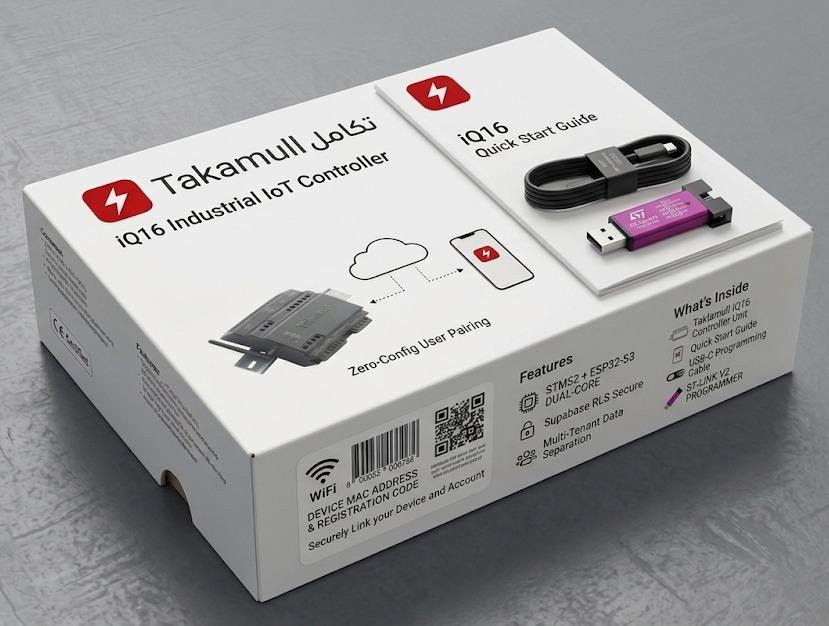

<br/>
<br/>

# Takamul iQ16 PLC

### Industrial IoT Controller — تكامل للحلول الذكية

<br/>

[](https://docs.espressif.com/projects/esp-idf/en/latest/)
[](https://www.st.com)
[](https://supabase.com)
[](https://www.kicad.org)
[](#)
[](#)

<br/>

> **Dual-core STM32F405 + ESP32-S3 · Supabase Multi-Tenant Cloud · Modbus RTU · DIN-Rail Mount**
> Designed for water treatment, flow control, and process automation in harsh industrial environments — engineered in Egypt 🇪🇬

</div>

---

## Table of Contents

- [Overview](#overview)
- [Key Features](#key-features)
- [System Architecture](#system-architecture)
- [Hardware](#hardware)
  - [PCB](#pcb--ona_hard)
  - [Mechanical Enclosure — V1](#mechanical-enclosure--v1)
  - [Mechanical Enclosure — V2](#mechanical-enclosure--v2)
- [Firmware](#firmware)
- [Cloud & Connectivity](#cloud--connectivity)
- [Repository Structure](#repository-structure)
- [Getting Started](#getting-started)
- [Supported Instruments](#supported-instruments)

---

## Overview

The **Takamul iQ16** is a compact, DIN-rail mounted industrial PLC built for real-world process automation. It pairs a **STM32F405RGT6** real-time controller — handling deterministic Modbus RTU field communication — with an **ESP32-S3** managing Wi-Fi, MQTT, and secure cloud telemetry via **Supabase Row-Level Security**.

Every unit ships ready to deploy: scan the MAC QR code on the box, link it to your account, and the device self-configures with zero manual setup.

**Built for:**
- Water treatment & desalination plants
- Flow metering systems (Endress+Hauser Promag P300)
- Multi-parameter water quality monitoring (TDS, pressure, temperature, differential)
- VFD pump control automation

---

## Key Features

| | Feature | Detail |
|---|---|---|
| ⚙️ | **Dual-Core Processing** | STM32F405RGT6 (real-time control) + ESP32-S3 (connectivity) |
| 📡 | **Field Protocols** | Modbus RTU × 2 ports (RS-485), bridged to cloud via MQTT |
| 🌊 | **Sensor Inputs** | Flow · Pressure · TDS · Temperature · Differential (5 channels) |
| ⚡ | **Actuator Outputs** | VFD Control × 2 (Variable Frequency Drive) |
| 🔋 | **Power Supply** | 12–24V DC wide-range input, onboard LM2596S regulator |
| 📶 | **Connectivity** | Wi-Fi 802.11 b/g/n, external SMA antenna, USB-C programming |
| ☁️ | **Cloud Backend** | Supabase PostgreSQL + RLS — multi-tenant, per-device data isolation |
| 🔐 | **Security** | JWT auth, RLS policies, NVS encrypted credential storage |
| 💡 | **Status Indicators** | Power · Run · Error · Comms · Wi-Fi (5 onboard LEDs) |
| 📦 | **Form Factor** | DIN-rail 35mm TS35, 3D-printable enclosure included |
| 🔌 | **Programming** | ST-LINK V2 (STM32) + USB-C ESP-IDF (ESP32) |
| 📋 | **Zero-Config** | MAC-based QR pairing — no manual IP or credential entry |

---

## System Architecture

```
┌─────────────────────────────────────────────────────────┐
│                    Field Instruments                     │
│  [Flow Meter]  [Pressure]  [TDS]  [Temp]  [Diff]       │
└──────────────────────┬──────────────────────────────────┘
                       │ Modbus RTU (RS-485)
              ┌────────▼────────┐
              │   STM32F405     │  ← Real-time deterministic control
              │  Modbus Master  │  ← VFD pump output control
              │  FreeRTOS       │
              └────────┬────────┘
                       │ UART (115200 baud)
              ┌────────▼────────┐
              │    ESP32-S3     │  ← Wi-Fi / MQTT / Cloud
              │  WifiManager    │
              │  SupabaseClient │──────────► Supabase Cloud
              │  MqttManager    │              (PostgreSQL + RLS)
              │  TelemetryMgr   │
              │  WebServer      │──────────► Local Config Portal
              │  NVSManager     │
              └─────────────────┘
```

---

## Hardware

### PCB — `ONA_HARD/`

The iQ16 PCB is a **4-layer board** designed in KiCad 7. The stackup separates power planes from signal layers to ensure clean analog sensor readings alongside noisy RS-485 and switching regulator circuits.

| Spec | Value |
|---|---|
| Layers | 4 (F.Cu · In1.Cu · In2.Cu · B.Cu) |
| MCUs | STM32F405RGT6 + ESP32-S3 module |
| Power | LM2596S buck converter, 220µF/35V + 100µF/50V bulk caps |
| RS-485 | Dual Modbus ports (ModBus 1: A/B, ModBus 2: Y/Z) |
| Programming | USB-C (ESP32) + ST-Link header (STM32) |
| Mounting | 4× M3 corner holes for DIN-rail clip assembly |
| Design tool | KiCad 7 |
| Fabrication | Gerber + drill files ready (JLCPCB / PCBWay) |

<table>
  <tr>
    <td align="center" width="50%">
      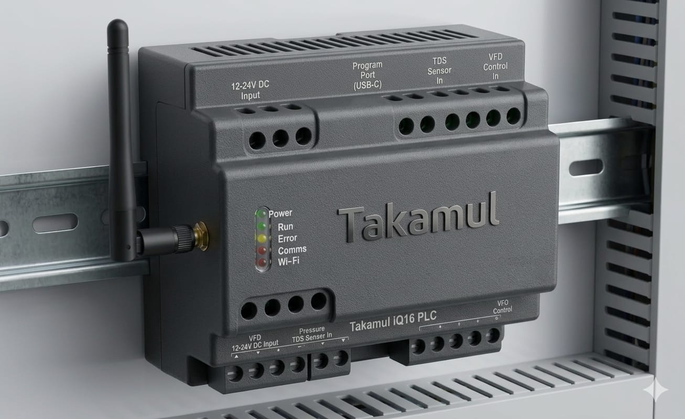
      <br/><sub><b>iQ16 — DIN-Rail Mounted</b></sub>
    </td>
    <td align="center" width="50%">
      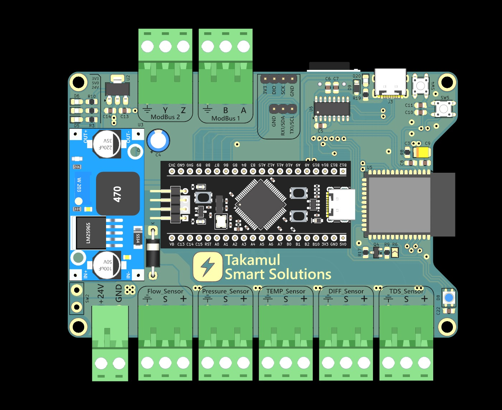
      <br/><sub><b>PCB — Top View (3D Render)</b></sub>
    </td>
  </tr>
  <tr>
    <td align="center" width="50%">
      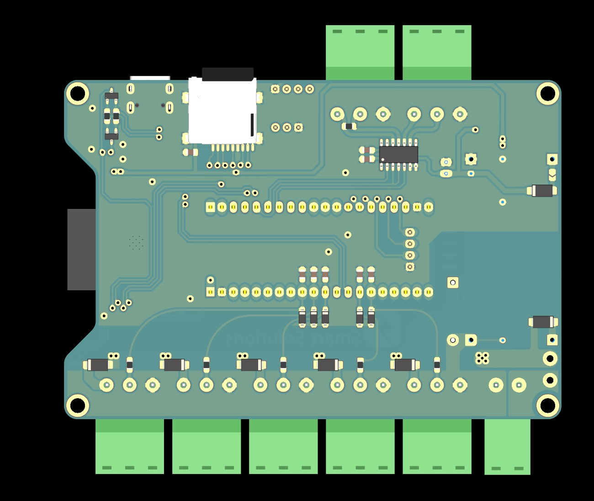
      <br/><sub><b>PCB — Back View (3D Render)</b></sub>
    </td>
    <td align="center" width="50%">
      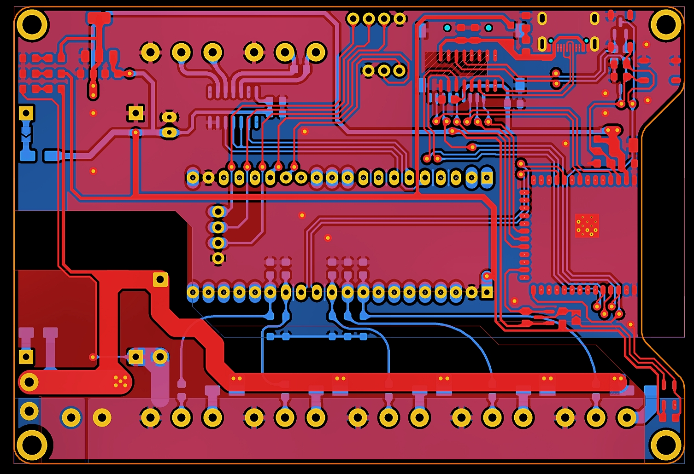
      <br/><sub><b>PCB — KiCad Layout (All Copper Layers)</b></sub>
    </td>
  </tr>
</table>

---

### Mechanical Enclosure — V1

First-generation 3D-printable enclosure. A 4-part snap-fit design tailored for DIN-rail deployment in standard control cabinets.

**Parts:** `Body` · `Face cover` · `Back cover` · `Head cover`

<table>
  <tr>
    <td align="center" width="50%">
      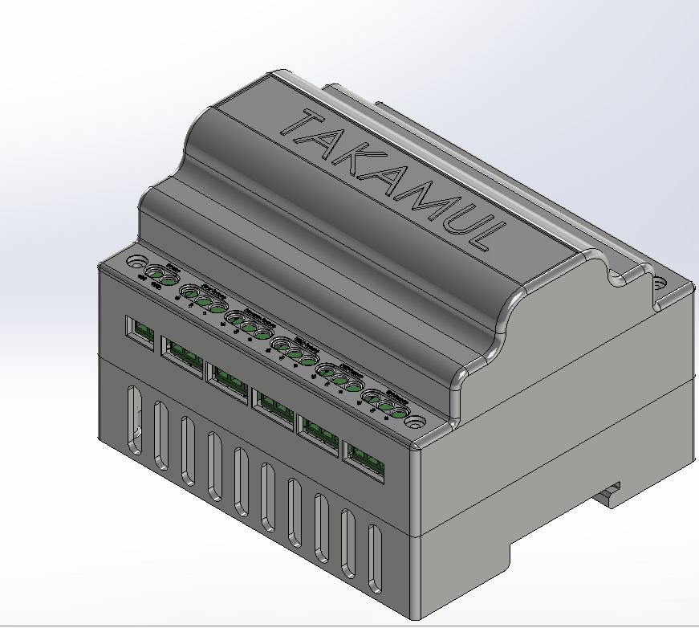
      <br/><sub><b>V1 — Full Assembly (3D View)</b></sub>
    </td>
    <td align="center" width="50%">
      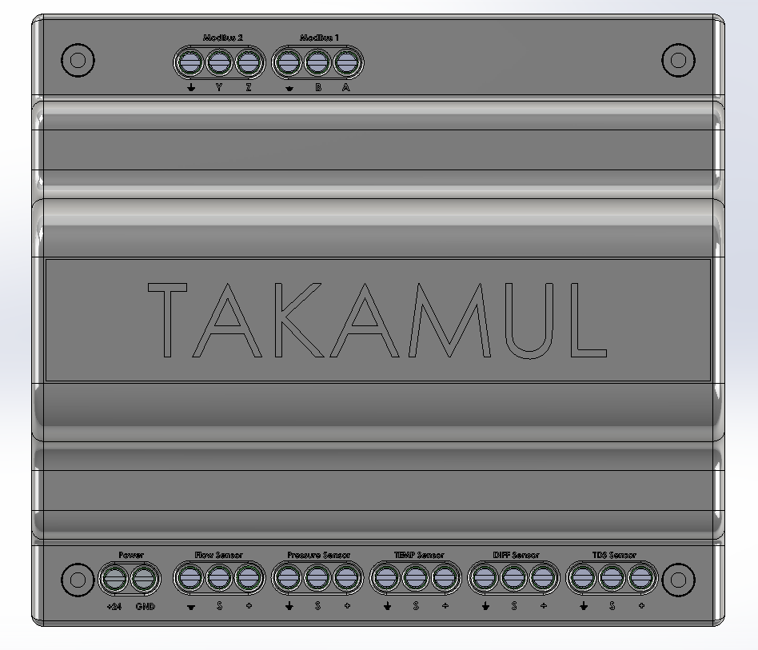
      <br/><sub><b>V1 — Front Panel View</b></sub>
    </td>
  </tr>
  <tr>
    <td align="center" width="50%">
      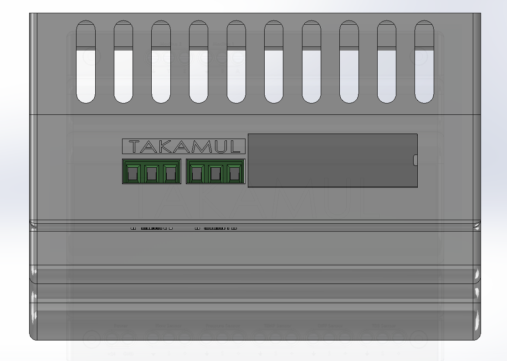
      <br/><sub><b>V1 — Side Profile</b></sub>
    </td>
    <td align="center" width="50%">
      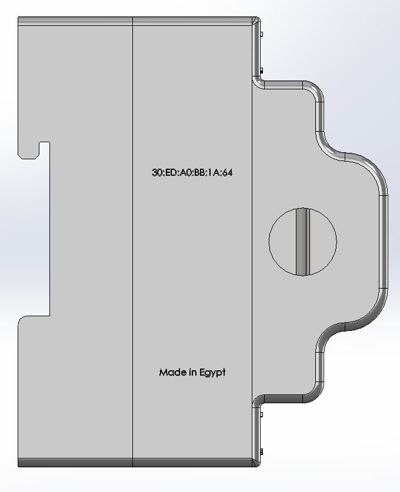
      <br/><sub><b>V1 — Internal Layout</b></sub>
    </td>
  </tr>
</table>

All V1 files are in `mechanical/V1/` — CAD source (`.SLDPRT` / `.SLDASM`) and print-ready STLs.

---

### Mechanical Enclosure — V2

Second-generation enclosure with improved cable management, refined connector cutouts, and a modular split body for easier PCB insertion and field service.

**Parts:** `Body` · `Face` · `Back` · `Part1348` (DIN clip assembly)

<table>
  <tr>
    <td align="center" width="50%">
      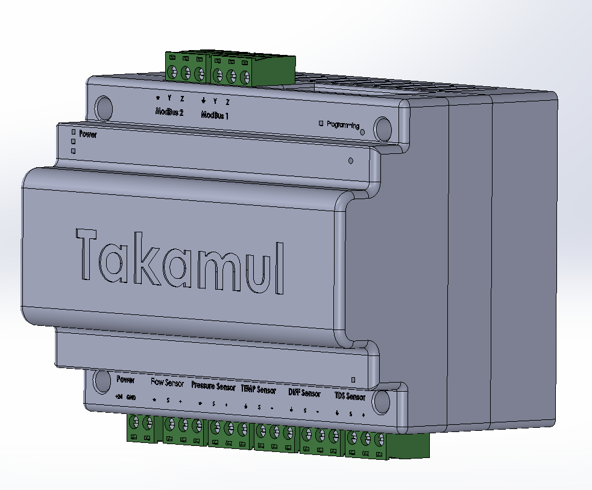
      <br/><sub><b>V2 — Full Assembly (3D View)</b></sub>
    </td>
    <td align="center" width="50%">
      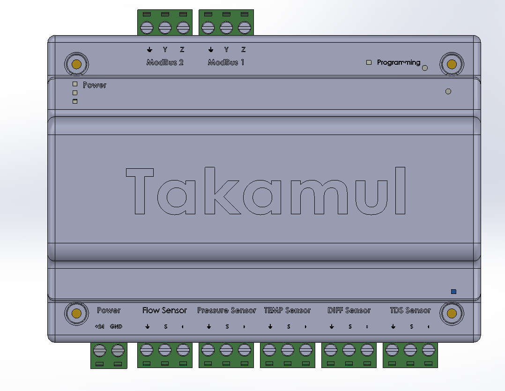
      <br/><sub><b>V2 — Front Panel View</b></sub>
    </td>
  </tr>
  <tr>
    <td align="center" width="50%">
      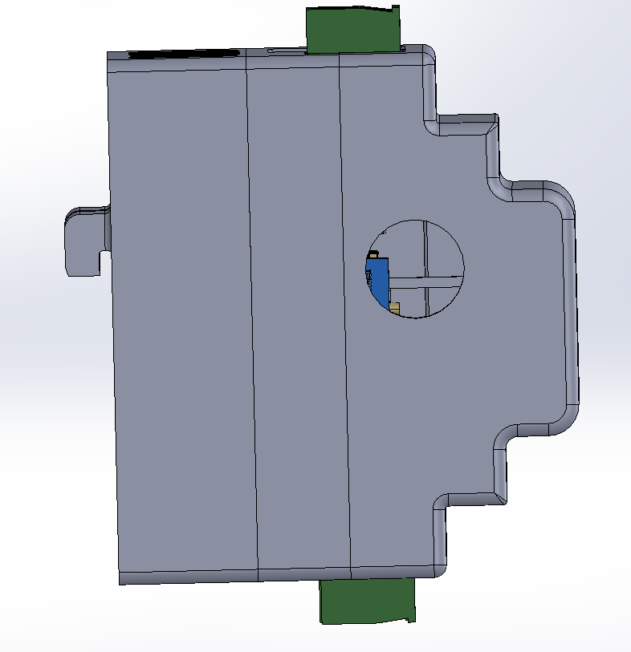
      <br/><sub><b>V2 — Side Profile</b></sub>
    </td>
    <td align="center" width="50%">
      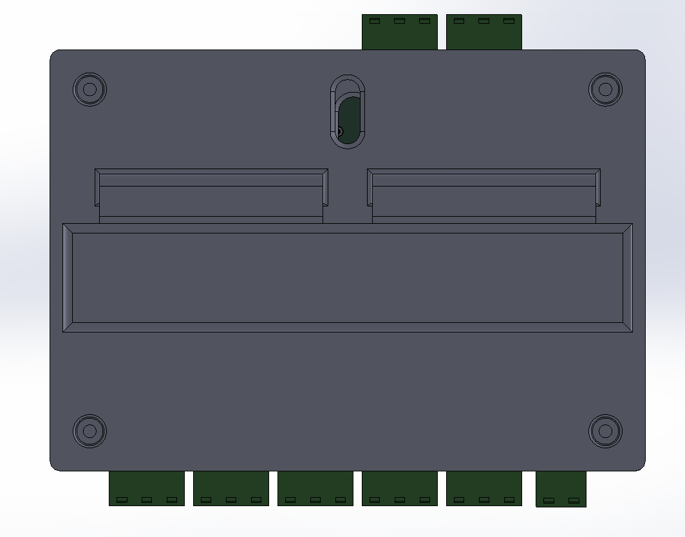
      <br/><sub><b>V2 — Rear Connector Cutouts</b></sub>
    </td>
  </tr>
  <tr>
    <td align="center" colspan="2">
      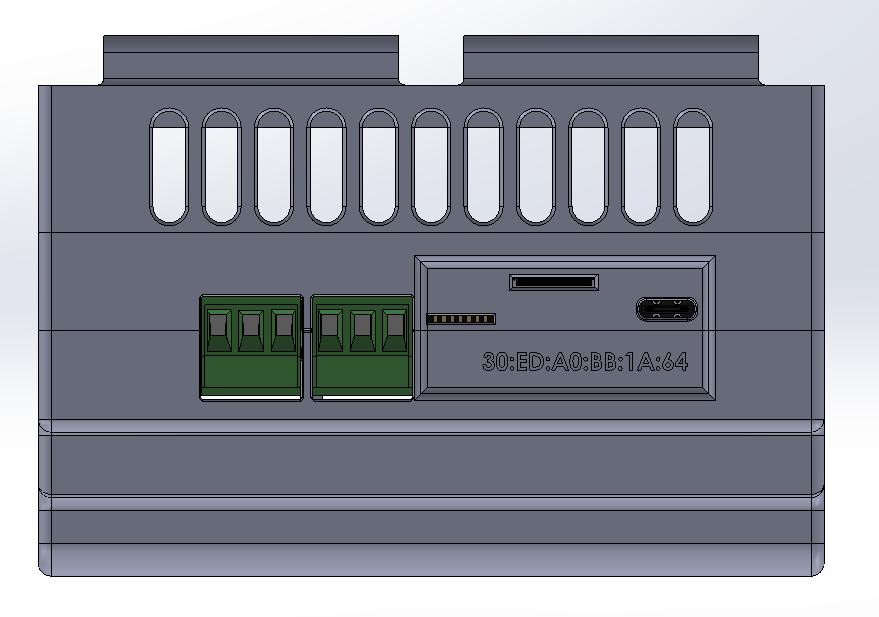
      <br/><sub><b>V2 — Exploded View / DIN Clip Detail</b></sub>
    </td>
  </tr>
</table>

All V2 files are in `mechanical/V2/` — CAD source and print-ready STLs.

> **Production-ready STL + OBJ** files (the version shipped with the product) are in `mechanical/sample/cad_v2/`. These include every printable part: `assembly`, `base`, `front_lid`, `top_lid`, `top_connectors`, `bottom_connectors`, `din_clip`, `wifi_module`, `antenna`, `standoff`, `screw_m3x8`.

---

## Firmware

### ESP32-S3 — `ONA_Software/software_v1/` (ESP-IDF v5)

The ESP32 owns all network and cloud operations, acting as a transparent bridge between the STM32 field data and the Supabase backend.

```
Takamul:: namespace
│
├── NVSManager        Flash-backed credential & config storage
├── WifiManager       Auto-connect, reconnect, provisioning fallback
├── SupabaseClient    HTTPS REST client — insert/query with JWT RLS auth
├── TelemetryManager  Periodic sensor data batching & upload
├── MqttManager       Real-time bidirectional command channel
├── UartBridge        UART2 ↔ STM32 framing & protocol (GPIO 16/17)
├── WebServer         Local HTTP config portal for Zero-Config pairing
├── OtaManager        OTA firmware update over HTTPS
└── SleepManager      Deep-sleep power management
```

**Configuring credentials** (via `idf.py menuconfig → Takamul Config`):

```
CONFIG_TAKAMUL_SUPABASE_URL   → your Supabase project URL
CONFIG_TAKAMUL_SUPABASE_KEY   → your anon/service role key
```

### STM32F405 — `ONA_Software/tests/modbus_v2/` (STM32CubeIDE)

Runs a deterministic FreeRTOS Modbus RTU master stack over RS-485. Polls all field instruments on configurable scan cycles and pushes structured telemetry frames to the ESP32 over UART.

### Modbus Mapping — `ONA_Software/tests/modbus_mapping_controll/`

STM32 firmware variant with full register mapping and VFD control logic — maps physical Modbus registers from flow meters, TDS analyzers, and pressure transmitters to structured data objects sent upstream.

---

## Cloud & Connectivity

| Layer | Technology | Purpose |
|---|---|---|
| **Database** | Supabase PostgreSQL | Persistent sensor telemetry & device registry |
| **Security** | Row-Level Security (RLS) | Per-device data isolation, multi-tenant safe |
| **Auth** | JWT tokens | Device identity tied to MAC address |
| **Real-time** | Supabase Realtime | Live dashboard subscriptions |
| **Commands** | MQTT pub/sub | Low-latency actuator control (VFD setpoints) |
| **Local config** | HTTP Web Server | Zero-Config Wi-Fi & account pairing |
| **Pairing** | QR code on box | MAC address → account link, no manual entry |
| **OTA** | HTTPS OTA | Remote firmware updates for ESP32 |

---

## Repository Structure

```
Takamul_ONA/
│
├── ONA_HARD/                          # Hardware design files
│   ├── STM32 & ESP32.kicad_pro       # KiCad 7 project
│   ├── STM32 & ESP32.kicad_sch       # Schematic
│   ├── STM32 & ESP32.kicad_pcb       # PCB layout
│   ├── BOM.xlsx                       # Bill of Materials
│   ├── STM32 & ESP32.pdf             # Schematic PDF export
│   ├── STEP File.step                 # Full assembly STEP
│   ├── top.jpeg / Back.jpeg          # PCB 3D renders
│   └── pcb_Layout.jpeg               # KiCad layout screenshot
│
├── ONA_Software/
│   ├── software_v1/esp32s3_project/  # ESP32-S3 firmware (ESP-IDF v5)
│   │   └── main/
│   │       ├── main.cpp / main.h
│   │       ├── src/
│   │       │   ├── WifiManager.cpp
│   │       │   ├── SupabaseClient.cpp
│   │       │   ├── TelemetryManager.cpp
│   │       │   ├── UartBridge.cpp
│   │       │   ├── WebServer.cpp
│   │       │   ├── MqttManager.cpp
│   │       │   ├── NVSManager.cpp
│   │       │   ├── OtaManager.cpp
│   │       │   └── SleepManager.cpp
│   │       └── inc/                  # Corresponding headers
│   │
│   ├── tests/
│   │   ├── modbus_v2/               # STM32F405 Modbus RTU stack (FreeRTOS)
│   │   ├── modbus_mapping_controll/ # Register mapping & VFD control logic
│   │   ├── STM32_Main/              # STM32F401 base firmware tests
│   │   ├── TestModbus/              # Modbus protocol unit tests
│   │   ├── stm32_master/            # STM32F103 Modbus master prototype
│   │   ├── main_esp32/              # ESP32 (original) integration tests
│   │   └── test_db/                 # ESP32 Supabase integration tests
│   │
│   └── data_sheets/                 # Instrument Modbus documentation
│       ├── Promag_P300_modbus_map.pdf
│       └── CM44x_modbus_map.pdf
│
├── mechanical/
│   ├── V1/                          # Enclosure V1 (SolidWorks + STL)
│   │   ├── CAD/                     # .SLDPRT source files
│   │   ├── STL/                     # Print-ready STL files
│   │   └── PNG/                     # 3D renders (3D, S1, S2, S3)
│   │
│   ├── V2/                          # Enclosure V2 (SolidWorks + STL)
│   │   ├── CAD/                     # .SLDPRT source files
│   │   ├── STL/                     # Print-ready STL files
│   │   └── PNG/                     # 3D renders (3D, S1, S2, S3, S4)
│   │
│   └── sample/                      # Production-ready assets
│       ├── cad_v2/                  # Final STL + OBJ (all parts)
│       ├── docs/
│       │   ├── bom_v2.csv
│       │   └── takamul_iq16_drawing_pack.pdf
│       ├── case.jpeg                # Mounted enclosure photo
│       └── pkg.jpeg                 # Product packaging render
│
└── docs/
    └── images/                      # README assets
```

---

## Getting Started

### What's in the Box

- Takamul iQ16 Controller Unit
- Quick Start Guide
- USB-C Programming Cable
- ST-LINK V2 Programmer

### Prerequisites

| Tool | Purpose | Link |
|---|---|---|
| ESP-IDF v5 | ESP32-S3 firmware build | [docs.espressif.com](https://docs.espressif.com/projects/esp-idf/en/latest/) |
| STM32CubeIDE | STM32 firmware build & flash | [st.com](https://www.st.com/en/development-tools/stm32cubeide.html) |
| KiCad 7 | PCB schematic & layout | [kicad.org](https://www.kicad.org) |
| ST-LINK V2 | STM32 programmer (included) | — |

### Flash ESP32 Firmware

```bash
cd ONA_Software/software_v1/esp32s3_project
idf.py set-target esp32s3
idf.py menuconfig        # Takamul Config → set Supabase URL & key
idf.py build flash monitor
```

### Flash STM32 Firmware

```bash
# Open in STM32CubeIDE
File → Open Projects from File System → ONA_Software/tests/modbus_v2/

# Build & flash via ST-LINK V2
Project → Build (Ctrl+B)
Run → Debug (connects via ST-LINK header)
```

### Open PCB in KiCad

```bash
kicad ONA_HARD/
# Open "STM32 & ESP32.kicad_pro" → Schematic Editor or PCB Editor
```

### Print the Enclosure (V2 — Production)

All production STL files are in `mechanical/sample/cad_v2/`. Recommended print order:

1. `base.stl` — main enclosure body
2. `din_clip.stl` — DIN-rail clip
3. `front_lid.stl` — front panel
4. `top_lid.stl` — top cover
5. `top_connectors.stl` + `bottom_connectors.stl` — terminal cutout panels
6. `standoff.stl` × 4 — PCB standoffs
7. `wifi_module.stl` — ESP32 module retainer
8. `antenna.stl` — SMA antenna bracket

> **Recommended settings:** PLA or PETG, 0.2mm layer height, 4 perimeters, 30% infill.

---

## Supported Instruments

| Instrument | Protocol | Datasheet |
|---|---|---|
| Endress+Hauser Promag P300 | Modbus RTU | `ONA_Software/data_sheets/Promag_P300_modbus_map.pdf` |
| Endress+Hauser Liquiline CM44x | Modbus RTU | `ONA_Software/data_sheets/CM44x_modbus_map.pdf` |
| Generic TDS Sensor | Analog / RS-485 | — |
| Generic Pressure Transmitter | 4–20 mA | — |
| Generic Temperature Sensor | Analog | — |

---

<div align="center">

<br/>

**Takamul Smart Solutions — تكامل للحلول الذكية**

*Industrial IoT, engineered in Egypt 🇪🇬*

<br/>

</div>
